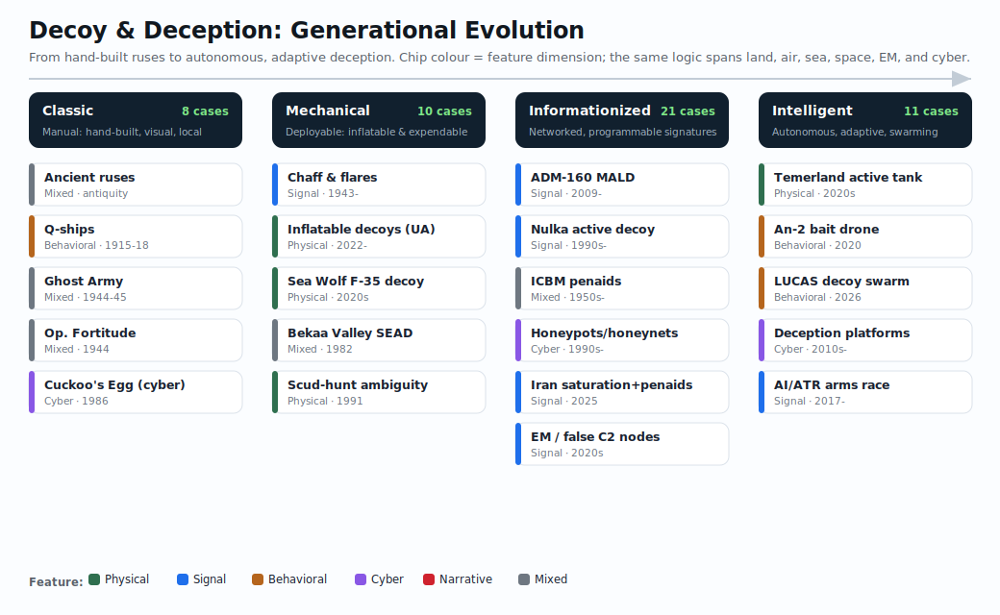

# Awesome Decoys / 假目标与诱饵大全

[English](README.md) | 中文

> 一个关于 dummy targets、decoys、deception systems、实体假目标、信号诱饵、网络欺骗、多谱段签名、主动诱饵和可消耗自主系统的公开资料知识库。
>
> 本项目面向“假目标/诱饵”建立公开资料层面的大全：覆盖古往今来的案例、实体/信号/网络形态、经典式/机械化/信息化/智能化演进，以及设计、制造、部署、测试和评估等技术环节。

## 目录

- [核心思想](#核心思想)
- [范围与分类体系](#范围与分类体系)
- [阅读地图](#阅读地图)
- [案例库](#案例库)
- [来源质量分级](#来源质量分级)
- [中文版](#中文版)
- [条令与概念](#条令与概念)
- [现代战场经验](#现代战场经验)
- [近期冲突（2020-2026）](#近期冲突2020-2026)
- [信号与可消耗诱饵硬件](#信号与可消耗诱饵硬件)
- [充气式与实体假目标](#充气式与实体假目标)
- [主动与自主诱饵](#主动与自主诱饵)
- [电磁与多谱段欺骗](#电磁与多谱段欺骗)
- [网络诱饵（蜜罐、蜜标、欺骗）](#网络诱饵蜜罐蜜标欺骗)
- [反诱饵与鉴别](#反诱饵与鉴别)
- [飞机与机场假目标](#飞机与机场假目标)
- [装甲车辆与火炮假目标](#装甲车辆与火炮假目标)
- [产业与厂商](#产业与厂商)
- [自主式假飞机系统](#自主式假飞机系统)
- [技术关键词](#技术关键词)
- [研究问题](#研究问题)
- [扩展来源索引](#扩展来源索引)
- [本地种子文档](#本地种子文档)
- [待办](#待办)

## 核心思想

- **诱饵是一种通用方法** - 诱饵可以是对象、信号、行为、身份、账户、系统或叙事，使观察者、传感器、算法或武器系统错误分配注意力、时间、弹药或行动。
- **透明战场** - 持续 ISR、无人机、SAR、红外感知、SIGINT 和 AI 辅助识别正在压缩“发现到打击”的时间。
- **诱饵即防护** - 诱饵把防护从被动隐藏，推向主动操纵对手的目标循环。
- **成本强加** - 低成本假目标可以迫使对手消耗昂贵精确弹药和稀缺 ISR 注意力。
- **多谱段可信度** - 有效诱饵越来越需要光学、热、雷达、电磁、声学和行为一致性。
- **从静态到主动** - 发展路径正在从视觉模型走向遥控、自主、传感器感知和蜂群化诱饵系统。
- **欺骗是系统** - 最有价值的诱饵不是孤立物体，而是更大虚假战场叙事的一部分。

## 范围与分类体系

完整分类体系见 [`docs/taxonomy.zh-CN.md`](docs/taxonomy.zh-CN.md)，英文版见 [`docs/taxonomy.md`](docs/taxonomy.md)。案例数据 schema 见 [`docs/case-schema.zh-CN.md`](docs/case-schema.zh-CN.md)。



本项目按多个维度组织 dummy / decoy systems。

### 时间维度

- **古代与前工业时代** - 疑兵营地、假火光、假阵形、佯退、诈术，以及机械化传感器出现前的视觉欺骗。
- **工业化时代** - 假炮、假舰、假机场、假工厂、伪装学校，以及作战层级的大规模欺骗。
- **冷战与精确打击时代** - 雷达诱饵、导弹诱饵、机动发射车不确定性、防空欺骗、电子战、加固目标欺骗。
- **当代透明战场** - 无人机观察下的假目标、充气式武器系统、假指挥所、多谱段签名、AI 辅助目标识别和成本强加。
- **新兴智能欺骗** - 自主诱饵车辆、自适应签名控制、诱饵蜂群、网络-物理欺骗、合成数据、闭环欺骗效果评估。

### 特征维度

- **实体/物理诱饵** - 假坦克、飞机、舰船、导弹、火炮、雷达、C2 节点、桥梁、建筑、补给站和类人员目标。
- **信号诱饵** - 无线电流量、雷达反射器、RF 信标、虚假电磁辐射、声学签名、热签名和合成雷达回波。
- **行为诱饵** - 运动模式、维护节奏、车队时序、巡逻轨迹、发射准备、机场运行节奏和 pattern-of-life 伪造。
- **网络诱饵** - 蜜罐、蜜标、假凭证、诱饵服务、欺骗网络、诱饵数据、假身份和对手交互环境。
- **叙事与情报诱饵** - 虚假战斗序列、双重间谍渠道、受控泄露、误导性后勤痕迹和跨来源虚假确认。

### 物理演进维度

- **经典式 / 人工式** - 木材、帆布、织物、火光、涂装表面、假营地和手工模型。
- **机械化 / 可部署式** - 充气形体、折叠框架、拖车、机动模型、发射器、加热器、角反射器和可拖曳/可转移诱饵。
- **信息化 / 网络化** - 电磁签名发生器、可编程辐射、传感器触发诱饵、遥控、分布式假节点和多源协同。
- **智能化 / 自主式** - 无人诱饵车辆、自主转移、自适应热/RF 控制、蜂群行为、AI 生成签名和闭环评估。

### 技术生命周期维度

- **设计与生成** - 目标签名建模、威胁传感器建模、CAD/数字孪生、合成图像生成、RCS/热/声学设计、网络诱饵设计和场景生成。
- **生产与制造** - 充气生产、增材制造、模块化框架、涂层、加热器、RF 载荷、低成本电子、网络靶场模板和野战维修包。
- **部署与运用** - 布设、隐蔽、激活时机、机动性、辐射控制、后勤、操作者负荷、欺骗叙事一致性和与真实部队整合。
- **测试与评估** - 面向传感器测试、红队分类、BDA 模糊性、成本交换分析、生存力建模、网络交互指标和闭环欺骗有效性。

### 其他维度

- **领域** - 陆、空、海、水下、太空、电磁频谱、网络、信息和跨域诱饵。
- **目标类别** - 人员、车辆、飞机、舰船、导弹、雷达、防空系统、C2 节点、后勤、基础设施、卫星、身份、服务和数据集。
- **观察者或受害方** - 人类观察员、飞行员、无人机操作员、卫星分析员、雷达处理器、导弹 seeker、AI 分类器、网络入侵者或决策者。
- **效果机制** - 吸引火力、吸收弹药、拖延决策、过载 ISR、掩护真实机动、污染 BDA、制造虚假信心、暴露敌方传感器或塑造敌方机动。
- **逼真度层级** - 仅视觉、单一签名、多谱段、行为级、网络化或叙事级欺骗。
- **成熟度层级** - 概念、历史案例、原型、训练器材、商业产品、列装系统、战场观察系统或已验证作战效果。
- **成本与规模化** - 一次性手工、部队自制、商业批产、可大规模生产、可消耗、可复用或软件可复制。
- **反诱饵角度** - SAR/IR/雷达/EO 异常检测、pattern-of-life 校验、AI 分类器鲁棒性、多源融合、网络指纹识别和取证归因。
- **来源类型 / provenance** - 知识来源的体裁：同行评审期刊、会议论文、书籍、智库报告、政府/军方文件、军事专业期刊、专业防务媒体、新闻媒体、厂商/产业材料、分析博客、OSINT/社交媒体、数据集和机构参考。该维度与 A/B/C/D 质量等级正交，并记录于 [`data/sources.csv`](data/sources.csv)。

## 阅读地图

### 从这里开始

- [Like Moths to a False Flame](https://www.army.mil/article/286861/like_moths_to_a_false_flame_lethality_and_protection_through_deception_operations) - 美国陆军文章，把欺骗描述为迫使对手对虚假信息反应并浪费资源的方法。
- [A Tool for Deception: The Urgent Need for EM Decoys](https://warroom.armywarcollege.edu/articles/tactical-decoys/) - 美国陆军战争学院文章，聚焦电磁诱饵和低成本频谱欺骗。
- [Implementing DoD Replicator Initiative at Speed and Scale](https://www.diu.mil/latest/implementing-the-department-of-defense-replicator-initiative-to-accelerate) - DIU 关于规模化全域可消耗自主系统的文章。
- [Russia And Ukraine Are Deploying Increasingly Advanced Decoy Tanks](https://www.forbes.com/sites/vikrammittal/2025/03/03/russia-and-ukraine-are-deploying-increasingly-advanced-decoy-tanks/) - Forbes 对俄乌战争中诱饵装甲车辆的概览。
- [Sea Wolf Global F-35 Jet Fighter Decoy System](https://www.seawolfglobal.com/dni/product_f35.html) - 充气式 F-35 假目标系统公开产品页。

### 技术概览

- [INFLATECH - Inflatable Military Decoys](https://www.inflatechdecoy.com/) - 充气式假目标类别与用途的厂商概览。
- [INFLATECH News](https://www.inflatechdecoy.com/news/) - 厂商新闻，提及现实热签名与雷达签名。
- [Sea Wolf Global](https://seawolf502.cafe24.com/shop3/) - 公司概览，把充气式假目标与无人/机器人控制概念联系起来。
- [Temerland Leopard Tank Decoy](https://temerland.com/en/temerland-is-making-an-unmanned-model-of-a-leopard-tank-based-on-a-regular-car-to-fool-russians/) - 基于普通车辆的机动/遥控“主动假目标”示例。

### 历史与条令背景

- [Hiding in Plain Sight](https://www.armyupress.army.mil/Journals/Military-Review/English-Edition-Archives/March-April-2023/Hiding/) - Army University Press 关于欺骗规划和诱饵阵地的文章。
- [Deception in the Desert](https://www.armyupress.army.mil/Books/Browse-Books/iBooks-and-EPUBs/Deception-in-the-Desert/) - 沙漠风暴行动欺骗历史案例。
- [Assault on Fortress Europe](https://www.armyupress.army.mil/Journals/Military-Review/Online-Exclusive/2020-OLE/Carminati-Assault-Fortress-Europe/) - 讨论诺曼底登陆前的坚忍行动南方，以及实体/信号欺骗。

## 案例库

初始案例库见 [`data/cases.csv`](data/cases.csv)，设计目标是后续可导入 Excel、SQLite、Notion 或静态站点。

交互式、离线、自包含案例浏览器位于 [`assets/cases-explorer.html`](assets/cases-explorer.html)，可按类别、来源等级、时代筛选，并支持全文搜索。若启用 GitHub Pages，也可访问 [michaelcshn.github.io/awesome-decoys/assets/cases-explorer.html](https://michaelcshn.github.io/awesome-decoys/assets/cases-explorer.html)。

核心字段：

- `case_id` - 稳定案例标识。
- `period` / `time_dimension` - 年份、时代、冲突阶段或历史阶段。
- `actor` - 国家、军队、组织、厂商或倡议。
- `domain` - 陆、空、海、水下、太空、电磁频谱、网络、信息或跨域。
- `target_or_platform` - 诱饵模仿或保护的对象。
- `decoy_form` - 实体/物理、信号、行为、网络、叙事、充气、电磁、主动/机动、自主或混合。
- `mobility` - 静态、可转移、机动、遥控或自主。
- `spectral_features` - 光学、热、雷达、电磁、行为或多谱段特征。
- `lifecycle_stage` - 设计/生成、生产/制造、部署/运用、测试/评估或实战使用。
- `deception_effect` - 对敌 ISR、目标选择、火力、BDA 或资源分配的预期效果。
- `source_quality` - 下文定义的 A/B/C/D 来源等级。
- `source_refs` - 映射到 [`references/sources.md`](references/sources.md) 的短来源 key。

每行还包含 `feature_dimension`（physical/signal/behavioral/cyber/narrative/mixed）、`domain`（land/air/sea/space/ems/cyber/information/cross_domain）和 `physical_evolution`（classic/mechanical/informationized/intelligent），这些是案例浏览器的筛选轴。

Claim 级证据记录在 [`data/claims.csv`](data/claims.csv)。当一个案例包含多个应分开判断的说法时使用它，例如产品存在、部署报道、诱饵效果、成本交换、战果数字和争议性 BDA，避免把它们混用同一个置信度。

初始案例：

| 案例 | 时间 | 重点 | 为什么重要 |
|---|---:|---|---|
| 古代与古典诈术 | 古代 | 假营地、佯退、木马原型 | 展示诱饵逻辑，也就是制造虚假信念，早于传感器和精确火力。 |
| Q 船 | 1915-1918 | 伪装武装商船诱捕 U 艇 | 海上诱饵先祖；欺骗加表演式行为（panic party）。 |
| 二战 Starfish 诱饵场与假机场 | 1940-1944 | 闪电战中的诱饵火光/灯光和假机场 | 早期国家组织的假目标项目，把炸弹引向空地。 |
| 幽灵部队（第 23 总部特种部队） | 1944-1945 | 充气坦克、声响欺骗、假无线电、冒充 | 多线索一致性范例，是现代多谱段诱饵的历史模型。 |
| 坚忍行动南方 | 1944 | 假集团军、假登陆艇、无线电流量、双重间谍 | 经典案例：实体、信号和人源欺骗共同支撑一个虚假作战叙事。 |
| 沙漠风暴欺骗 | 1990-1991 | 两栖佯动、兵力姿态欺骗、假攻击预期 | 展示欺骗与机动、作战设计整合，而不是孤立诱饵物体。 |
| 沙漠风暴 Scud 搜猎 | 1991 | 机动导弹 TEL 不确定性与类似车辆/诱饵问题 | 说明机动假目标和不确定性如何消耗不成比例的 ISR 与打击资源。 |
| 科索沃 / 联军行动 | 1999 | 塞军伪装、诱饵、辐射纪律、IADS 打了就跑 | 展示弱势力量如何利用目标识别不确定性保存资产。 |
| 纳卡 An-2 诱饵无人机 | 2020 | 将有人机改为可消耗无人诱饵用于 SEAD | 可消耗诱饵暴露并压制敌防空的旗舰现代案例。 |
| 俄乌充气式假目标 | 2022 至今 | 坦克、火炮、飞机、HIMARS 类系统 | 无人机、精确火力、热传感器和公开 BDA 条件下的成本强加案例。 |
| 以伊直接打击 | 2024-2025 | 饱和齐射、混合威胁、机动/子母战斗部 | 信号级诱饵：压垮跟踪和优先级排序，消耗昂贵拦截弹。 |
| 胡塞红海战役 | 2023 至今 | 廉价无人机/导弹对多百万美元拦截弹 | 纯成本交换/不对称案例；机动发射车和地面诱饵增加反制难度。 |
| Sea Wolf F-35 诱饵 | 2020s | 带热/雷达类别的充气飞机诱饵 | 机场生存力和自主式假飞机需求的产业示例。 |
| Temerland 主动 Leopard 诱饵 | 2020s | 车辆式机动/遥控诱饵概念 | 连接被动模型与主动行为欺骗。 |
| EM 诱饵 / 假 C2 节点概念 | 2020s | 频谱欺骗、假辐射、指挥所诱饵 | 把诱饵从可见物体扩展到可探测签名。 |
| 敏捷战斗运用（ACE）背景 | 2020s | 机场分散、生存力、威胁时间线 | 说明飞机假目标、假停放模式和分布式基地欺骗为何重要。 |

## 来源质量分级

- **A - 主要官方 / 机构来源**：条令、官方军事文章、政府报告、RAND 等同级研究报告、厂商对自身产品的页面。
- **B - 可靠报道 / 专业媒体**：AP、RFE/RL、Forbes、The War Zone、专业防务媒体、具名专家文章。
- **C - 二次聚合**：博客、市场报告、转载、无来源摘要，或主要来自其他报道的文章。
- **D - 未核实 / 社交媒体**：社交媒体帖子、视频、仅图片说法，或需要独立确认的材料。

来源分级要保守使用：厂商页面可以是产品声明的 A 级来源，但不是独立效果验证；媒体可以是报道观察的 B 级来源，但没有交叉印证时不应当作已验证作战评估。

## 中文版

本项目已经为核心入口和专题指南建立并行中文版：

- [README.zh-CN.md](README.zh-CN.md) - 中文项目首页。
- [docs/taxonomy.zh-CN.md](docs/taxonomy.zh-CN.md) - 中文分类体系。
- [docs/case-schema.zh-CN.md](docs/case-schema.zh-CN.md) - 中文案例 schema。
- [docs/claim-schema.zh-CN.md](docs/claim-schema.zh-CN.md) - 中文 claim 级证据 schema。
- [docs/source-schema.zh-CN.md](docs/source-schema.zh-CN.md) - 中文来源 schema。
- [docs/cyber-decoys.zh-CN.md](docs/cyber-decoys.zh-CN.md) - 中文网络诱饵指南。
- [docs/counter-decoy.zh-CN.md](docs/counter-decoy.zh-CN.md) - 中文反诱饵指南。
- [docs/adas.zh-CN.md](docs/adas.zh-CN.md) - 中文 ADAS 指南。
- [docs/vendors.zh-CN.md](docs/vendors.zh-CN.md) - 中文厂商图谱。
- [docs/review-paper.zh-CN.md](docs/review-paper.zh-CN.md) - 基于本项目的中文综述论文草稿。
- [docs/project-proposal.zh-CN.md](docs/project-proposal.zh-CN.md) - 按重点研发计划风格撰写的项目申请书草稿。
- [data/README.zh-CN.md](data/README.zh-CN.md) - 中文数据文件指南。
- [CONTRIBUTING.zh-CN.md](CONTRIBUTING.zh-CN.md) - 中文贡献指南。

## 条令与概念

- [Deception Operations - Army University Press PDF](https://www.armyupress.army.mil/Portals/7/combat-studies-institute/csi-books/bjorge2.pdf) - 较早但有用的欺骗条令、基本原理和历史案例研究。
- [Hiding in Plain Sight](https://www.armyupress.army.mil/Journals/Military-Review/English-Edition-Archives/March-April-2023/Hiding/) - 将欺骗与侦察、火力和情报整合起来理解。
- [Sustainment Survivability](https://www.army.mil/article/267685/sustainment_survivability_incorporating_deception_at_the_tactical_level_in_the_brigade_support_area) - 旅支援地域的战术欺骗与后勤生存力。
- [Dispersion as Uncertainty](https://www.armyupress.army.mil/Journals/Military-Review/Online-Exclusive/2025-OLE/Dispersion-as-Uncertainty/) - 连接分散、不确定性、目标分拣和欺骗。
- [A Layered Approach to Active Protection](https://www.lineofdeparture.army.mil/Journals/Protection/Protection-Archive/2026-Edition/A-Layered-Approach-to-Active-Protection/) - 把欺骗纳入主动防护分层体系。

## 现代战场经验

- [Like Moths to a False Flame](https://www.army.mil/article/286861/like_moths_to_a_false_flame_lethality_and_protection_through_deception_operations) - 强调快速传感器到射手循环，以及欺骗对目标循环的削弱作用。
- [Beyond the Count: BDA for Modern Warfare](https://www.lineofdeparture.army.mil/Journals/Military-Intelligence/Military-Intelligence-Archive/2025-July-December/Beyond-the-Count/) - 指出诱饵和欺骗会使战损评估复杂化。
- [Russia And Ukraine Are Deploying Increasingly Advanced Decoy Tanks](https://www.forbes.com/sites/vikrammittal/2025/03/03/russia-and-ukraine-are-deploying-increasingly-advanced-decoy-tanks/) - 俄乌诱饵坦克和适应循环的核心现代案例。
- [USNI: Decoy Warfare in Ukraine](https://www.usni.org/magazines/proceedings/2024/april/decoy-warfare-lessons-and-implication-war-ukraine) - 从乌克兰战争总结诱饵战法和启示。
- [AP: False Target drone program](https://apnews.com/article/2f904b04fcc5de17549415a974f5a92b) - 对乌克兰“False Target”诱饵无人机项目的调查报道。

## 近期冲突（2020-2026）

### 纳卡 2020 - 诱饵压制防空

阿塞拜疆将苏制 An-2 改作可消耗诱饵无人机，使亚美尼亚防空雷达和发射阵地暴露，随后由 TB2 和 Harop 等系统打击。这是现代“诱饵即 SEAD”的代表性案例：诱饵不是为了保存自身，而是为了诱使防空系统暴露。

来源：`ARMY-NK2020-LESSONS`、`RAF-ASPR-NK-DRONES`、`BAS-AN2-CROPDUSTER`、`SWJ-NK-LESSONS`。

### 俄乌 - 假 HIMARS 与空中/机场假目标

乌克兰使用 HIMARS/M270、M777、雷达等假目标吸引俄军 Kalibr、Iskander 等昂贵弹药；俄罗斯也使用惰性巡航导弹、诱饵无人机、诱饵气球、假指挥所和机场涂装目标干扰乌军防空和 BDA。俄乌是本库中“低成本诱饵 + 高成本精确武器 + 无人机 ISR + 公开战损叙事”的核心现代案例。

来源：`NEWAMERICA-FUTURE-DECEPTION-2025`、`RUSI-UKRAINE-OFFENSIVE-2024`、`USNI-DECOY-WARFARE-UKRAINE`、`AP-FALSE-TARGET`、`WAPO-UA-HIMARS-DECOY`、`UP-KALIBR-VS-HIMARS`。

### 以伊与美以伊 - 饱和、突防辅助和成本交换

2024-2025 年以伊直接对攻显示，混合无人机、巡航导弹、弹道导弹、机动再入体和子母/分散战斗部可以在信号层面制造诱饵效应：防御方必须区分威胁、排序拦截、管理弹药库存并承受成本交换压力。这里的“诱饵”不是假坦克，而是多目标、多轨迹、多谱段的防御负载。

来源：`FPRI-SHALLOW-RAMPARTS`、`TWZ-IRAN-CLUSTER-WARHEAD`、`DSA-IRAN-SATURATION`、`SATURATION-LAYERED-BATTLEFIELD`。

### 胡塞 / 红海 - 成本交换问题

胡塞以低成本无人机、巡航导弹和弹道导弹迫使美英及联盟舰艇消耗昂贵拦截弹；移动发射车、隐蔽、诱饵系统和地面分散又增加反打击难度。DIA/CENTCOM 适合锚定威胁库存和打击背景，CSIS 支撑成本交换逻辑；具体诱饵系统和发射车生存率仍需继续寻找硬证据。

来源：`DIA-HOUTHI-IRAN`、`CSIS-COST-VALUE-AMD`、`CENTCOM-HOUTHI-TARGETS`、`NEWLINES-HOUTHI-DRONES`、`NBC-HOUTHI-DRONES`。

### 反转成本公式 - 进攻性诱饵（仍需保守标注）

LUCAS / Operation Epic Fury 报道显示，美国也在探索用低成本无人系统和蜂群/自主能力反向压迫对手防空。CENTCOM 来源可以锚定行动和平台存在，DefenseScoop、The War Zone、Defense.info 提供诱饵/饱和解释。当前应将“诱饵饱和角色”标为 A/B 而非完全验证。

来源：`CENTCOM-EPICFURY-FACTSHEET`、`CENTCOM-LUCAS-IMAGERY`、`DEFENSESCOOP-EPICFURY`、`TWZ-LUCAS-HIVEMIND`、`DEFENSEINFO-EPICFURY-LUCAS`。

## 信号与可消耗诱饵硬件

信号/可消耗诱饵是“信号”特征维度和“信息化”代际的骨干，横跨空中、海上、水下和战略领域。

### 可消耗 RF/IR 对抗（箔条与热焰弹）

箔条和热焰弹是最基础的可消耗诱饵：前者制造雷达散射和虚假回波，后者诱骗红外 seeker。现代红外诱饵必须面对成像红外、谱段比值和运动学鉴别，因此从简单热点转向多谱段、运动学、类飞机形状的诱饵。

来源：`DSIAC-DECOYS-US-MILITARY`、`GS-FLARES`、`WIKI-CHAFF`、`MM-COUNTERMEASURES`。

### 空射诱饵：TALD 与 MALD

ADM-141 TALD/ITALD 和 ADM-160 MALD/MALD-J 展示了从滑翔/动力诱饵到可编程、可模拟 RCS、可带干扰任务的空射诱饵演进。MALD-X/MALD-N 和 LUCAS 相关线索也把无人、自主、可消耗平台与欺骗任务连接起来。

来源：`FAS-TALD`、`DARPA-MALD-TIMELINE`、`DOTE-MALDJ-2016`、`RTX-MALD`、`ASF-MALD`、`DSN-MALD`。

### 空中拖曳诱饵

AN/ALE-50 和 AN/ALE-55 将诱饵拖在飞机后方，用 RF 或光纤拖曳体把雷达制导导弹的锁定点从宿主飞机转移出去。该类系统说明“诱饵”可以是与真实平台协同的外置签名节点，而不只是独立假目标。

来源：`GS-ALE50`、`BAE-ALE55`、`PATENT-ALE55`、`WIKI-ALE50`、`WIKI-ALE55`。

### 海上与水下诱饵：Nulka 与 Nixie

Nulka 是舰载有源悬停 RF 诱饵，诱导反舰导弹 seeker 离舰；AN/SLQ-25 Nixie 是拖曳式鱼雷声学诱饵。水下方向是当前应继续扩展的冷门维度：移动声学诱饵、可消耗声学对抗、UUV 假目标和鱼雷软杀伤仍需要更多官方/技术来源。

来源：`NAVY-NULKA-MK53`、`BAE-NULKA`、`DST-NULKA`、`FAS-NIXIE`、`ULTRA-TORPEDO-CM`、`GLSV-ACOUSTIC-CM`、`CLAUSIUS-ACOUSTIC-DECOYS-2022`。

### 战略突防辅助

弹道导弹突防辅助包括气球诱饵、箔条、复制 RV、IR 签名遮蔽、反模拟和干扰。中段真伪鉴别是太空/导弹防御领域的核心难题：在真空中轻诱饵和重弹头共享轨迹，使简单弹道鉴别失效。

来源：`CSIS-PENAIDS`、`SPARTA-CCD-SPACE-2023`、`USSF-SDA-2023`、`SPACECOM-LRDR`、`FEDREG-LRDR-ROD`、`GS-MIDCOURSE`。

## 充气式与实体假目标

充气式和实体假目标覆盖坦克、火炮、雷达、飞机、导弹发射车、卡车、指挥所和机场设施。它们的优势是成本低、部署快、可批量制造；弱点是容易在热、雷达、行为、后勤和时间维度露馅。现代趋势是增加热源、角反射器、局部金属结构、可移动平台和配套“故事”：车辙、人员活动、补给车辆、无线电流量和维护节奏。

- [INFLATECH](https://www.inflatechdecoy.com/) - 捷克高端充气式军事假目标生产商。
- [AP: Inflatable Tanks and Missiles](https://apnews.com/article/a9c478adb9d7ecaa615cb19b25f4833f) - 关于充气坦克、飞机、榴弹炮和 HIMARS 类诱饵的报道。
- [NorseStorm Inflatable Decoys](https://www.norsestorm.com/product-categories/inflatable-decoys) - INFLATECH 产品参考/分销页面。
- [i2k Defense](https://i2kdefense.com/inflatable-decoys-and-targets/) - 美国充气式诱饵和训练目标。

## 主动与自主诱饵

主动诱饵的关键不是“像”，而是“像一个真实目标那样行动”。这包括遥控移动、周期性转移、模拟维护、热状态变化、辐射节奏、假通信和诱饵蜂群。Temerland Leopard 概念、An-2 诱饵无人机、MALD、LUCAS 和未来 ADAS 都属于从静态假目标走向行为级欺骗的路径。

- [Temerland Leopard Tank Decoy](https://temerland.com/en/temerland-is-making-an-unmanned-model-of-a-leopard-tank-based-on-a-regular-car-to-fool-russians/) - 主动/机动坦克假目标概念。
- [DARPA MALD](https://www.darpa.mil/about/innovation-timeline/mald) - MALD 起源和低成本空射诱饵逻辑。
- [The War Zone: LUCAS Hivemind](https://www.twz.com/air/u-s-militarys-lucas-kamikaze-drone-is-getting-hivemind-swarming-capability) - LUCAS 与蜂群/自主方向。

## 电磁与多谱段欺骗

现代战场上，“可见目标”只是签名集合的一部分。一个可信假目标必须在 EO、IR、SAR/RCS、RF、声学、行为和后勤上尽量一致。电磁诱饵、假 C2 节点、虚假无线电流量、RF beacon、角反射器、加热器和发射器使诱饵从“看起来像”走向“被传感器系统认为像”。

- [A Tool for Deception: The Urgent Need for EM Decoys](https://warroom.armywarcollege.edu/articles/tactical-decoys/) - 电磁诱饵和频谱欺骗。
- [Thinking Through Deception on the Electromagnetic Spectrum](https://warontherocks.com/thinking-through-deception-on-the-electromagnetic-spectrum/) - 电磁频谱欺骗思考。
- [DefenseScoop: Army EM decoy systems](https://defensescoop.com/2024/03/22/army-electromagnetic-spectrum-decoy-obfuscation-systems-2025/) - 美陆军电磁诱饵和混淆系统进展。

## 网络诱饵（蜜罐、蜜标、欺骗）

网络诱饵把同一逻辑应用于软件、身份和数据：制造攻击者愿意触碰的假服务、假凭证、假文件、假账户或假网络，使任何交互都成为高置信入侵信号。与实体诱饵一样，网络诱饵也有逼真度、成本、可扩展性和反指纹识别问题。

诱饵阶梯可按交互深度理解：**蜜标**（单个诱饵数据）-> **低交互蜜罐**（模拟服务）-> **高交互蜜罐**（真实 OS/服务）-> **蜜网**（多个蜜罐组成网络）-> **分布式欺骗平台**（企业范围诱饵和 breadcrumb）。

- [MITRE Engage](https://engage.mitre.org/) - 对手交互框架（2022 年替代 MITRE Shield），映射到 ATT&CK。
- [MITRE D3FEND](https://d3fend.mitre.org/) - 包含显式诱饵技术的防御技术知识库。
- [The Honeynet Project](https://www.honeynet.org/) - 长期运行的非营利蜜罐研究社区。
- [Canarytokens](https://canarytokens.org/) - Thinkst 提供的免费蜜标生成器。
- [T-Pot](https://github.com/telekom-security/tpotce) - 集成 20+ 开源蜜罐的平台；包括 [Cowrie](https://github.com/cowrie/cowrie)、[Dionaea](https://github.com/DinoTools/dionaea)、[Conpot](https://github.com/mushorg/conpot)。
- [awesome-honeypots](https://github.com/paralax/awesome-honeypots) - 更广泛工具生态的社区目录。

历史锚点包括 Clifford Stoll 的 *The Cuckoo's Egg*（1986-87，假 “SDInet” 文档）、Cheswick 的 “An Evening with Berferd”（1991）和 Fred Cohen 的 Deception Toolkit（1998）。商业欺骗技术已经整合进 SentinelOne Singularity Identity（原 Attivo）、Proofpoint Shadow（原 Illusive）、Zscaler Deception（原 Smokescreen）等平台；对厂商效果声明应与实体假目标厂商同样谨慎。

## 反诱饵与鉴别

这是本项目的终点分支：诱饵如何被发现和击败。完整章节见 [`docs/counter-decoy.zh-CN.md`](docs/counter-decoy.zh-CN.md)，案例库中使用 `CD-` key。

主原则是 **一致性**：真实目标在形状、温度、雷达散射、运动、辐射、支援活动和后勤上自洽。诱饵之所以便宜，是因为它只伪造部分线索；反诱饵鉴别就是寻找它没有伪造好的一项，或寻找线索之间的矛盾。

| 诱饵 / 突防辅助 | 击败它的鉴别方法 | 诱饵响应 |
|---|---|---|
| 箔条 | 脉冲多普勒（速度快速衰减） | 更大云团、时机控制、与干扰结合 |
| 早期红外热焰弹 | 成像红外 + 运动学 | 多谱段、运动学、类飞机形状热焰弹 |
| 充气车辆 | SAR 散射 / 极化 | 角反射器、调谐蒙皮、热区 |
| 静态地面假目标 | 长时间 pattern-of-life | 机动、维护、辐射节奏（主动诱饵） |
| 中段气球诱饵 | 多现象学、空间传感器、LRDR | 反模拟、复制 RV、IR 遮蔽 |
| EO 可信诱饵 | 多源情报融合 | 增加 EM/行为/叙事层（故事级欺骗） |
| 蜜罐 | 指纹识别 / 环境检查 | 诱饵加固、真实活动模拟 |
| 任意目标 vs ATR | AI 分类器 | 对抗样本式诱饵，以及鲁棒 ATR 反制 |

AI 层值得单独注意：自动目标识别可以以机器速度鉴别诱饵，但 ATR 本身也可被攻击。基于散射体的 SAR 对抗扰动、物理可实现对抗样本、生成式伪装和仿真到现实合成，都让“诱饵本身成为对抗样本”成为研究前沿。

- [On the adversarial robustness of aerial detection](https://www.frontiersin.org/journals/computer-science/articles/10.3389/fcomp.2024.1349206/full) - 航空/SAR ATR 攻防综述。
- [A Survey of Adversarial Attacks on SAR Target Recognition](https://radars.ac.cn/en/article/doi/10.12000/JR24142) - SAR 目标识别对抗攻击综述。
- [SAR-PATT](https://www.mdpi.com/2072-4292/17/1/21) - 面向 SAR ATR 的物理场景对抗攻击。

## 飞机与机场假目标

- [Sea Wolf Global F-35 Jet Fighter Decoy System](https://www.seawolfglobal.com/dni/product_f35.html) - 飞机形状诱饵，公开性能类别。
- [Interesting Engineering: Inflatable F-35 Decoy Deploys in 10 Minutes](https://interestingengineering.com/military/inflatable-f35-military-decoy) - 快速部署 F-35 假目标报道。
- [Defense Redefined: Seawolf Marine F-35 Decoy](https://defenceredefined.com.cy/seawolf-marine-inflatable-dummy-decoy-of-the-f-35-stealth-fighter/) - F-35 充气假目标防务媒体报道。
- [Sandboxx: Korean Company's Inflatable F-35 Decoy](https://www.sandboxx.us/news/viral-video-shows-korean-companys-lifelike-inflatable-f-35-decoy/) - 成本和功能背景报道。
- [Sea Wolf Global Catalog PDF](https://seawolf.co.kr/catalog/ADEXca_en.pdf) - 更广泛充气武器系统诱饵产品目录。

## 装甲车辆与火炮假目标

- [Forbes: Advanced Decoy Tanks](https://www.forbes.com/sites/vikrammittal/2025/03/03/russia-and-ukraine-are-deploying-increasingly-advanced-decoy-tanks/) - 乌克兰诱饵坦克核心现代案例。
- [Temerland Leopard Tank Decoy](https://temerland.com/en/temerland-is-making-an-unmanned-model-of-a-leopard-tank-based-on-a-regular-car-to-fool-russians/) - 主动/机动坦克假目标概念。
- [Euromaidan Press: Ukraine's Decoy Tanks](https://euromaidanpress.com/2025/03/04/forbes-ukraines-decoy-tanks-trick-russian-forces-next-active-dummies-will-spy-on-them/) - Forbes 报道的乌克兰背景补充。
- [INFLATECH Product Overview](https://www.inflatechdecoy.com/) - 坦克、发射车、雷达、卡车、飞机等类别。
- [AP: Inflatable Tanks and Missiles](https://apnews.com/article/a9c478adb9d7ecaa615cb19b25f4833f) - 充气坦克、飞机、榴弹炮和 HIMARS 类诱饵报道。

## 产业与厂商

> 纳入这里不代表背书。这些来源用于市场映射和能力分类。

跨域结构化厂商图谱见 [`data/vendors.csv`](data/vendors.csv)，说明和 caveat 见 [`docs/vendors.zh-CN.md`](docs/vendors.zh-CN.md)。覆盖充气/实体、主动/自主、信号/EW 主承包商（Raytheon、BAE、L3Harris）、伪装/签名（Saab Barracuda、HDT）和网络欺骗厂商。注意：公开的充气式假目标市场规模数字彼此矛盾，且有联合报告把军事假目标与狩猎诱饵混在一起，因此不采信任何单一数字。

- [Sea Wolf Global](https://seawolf502.cafe24.com/shop3/) - 韩国充气式诱饵系统，包括飞机和火箭炮概念。
- [Sea Wolf F-35 Decoy](https://www.seawolfglobal.com/dni/product_f35.html) - F-35 诱饵公开页面。
- [INFLATECH](https://www.inflatechdecoy.com/) - 捷克高端充气军事假目标生产商。
- [i2k Defense](https://i2kdefense.com/inflatable-decoys-and-targets/) - 美国充气诱饵与训练目标。
- [i2k Co Defense](https://i2kco.com/defense/) - 美国制造的充气军事假目标。
- [NorseStorm Inflatable Decoys](https://www.norsestorm.com/product-categories/inflatable-decoys) - INFLATECH 产品分销/参考页。
- [JISR Institute Inflatable Military Decoys](https://jisr-institute.org/solutions/inflatable-military-decoys) - 充气式军事假目标高层服务页。
- [Strategic Market Research: Inflatable Decoy Market](https://www.strategicmarketresearch.com/market-report/inflatable-decoy-market) - 市场规模来源；正式引用前需核验。

## 自主式假飞机系统

本项目把 Autonomous Decoy Aircraft System（ADAS）视为主动诱饵的专门分支，面向机场生存力和分布式航空作战。完整深潜章节见 [`docs/adas.zh-CN.md`](docs/adas.zh-CN.md)，涵盖作战问题、多谱段可信栈、自主等级、成本交换模型、反诱饵韧性、评估计划和风险。

### 作战角色

- 在主基地、分散场、道路跑道和临时作战点制造可信的虚假飞机存在。
- 迫使对手花费 ISR 时间区分真实飞机、诱饵、支援设备和空掩体。
- 吸收或转移昂贵精确武器，保护真实飞机、燃油、弹药、C2 和维护资产。
- 通过增加多个小型作战地点的不确定性，支援敏捷战斗运用。

### 最小可信栈

| 层级 | 最小有用特征 | 高端特征 |
|---|---|---|
| 光学 | 飞机轮廓、比例、涂装、阴影、支援杂物 | 可配置机型变体、维护姿态、真实表面细节 |
| 热 | 发动机区域热源、太阳/环境热对比 | 多区加热、冷却时间表、随时间变化的热行为 |
| 雷达 | 雷达反射器或 RCS 增强 | 可调反射器或动态 RCS 塑形 |
| 电磁 | 可选信标或简单 RF 签名 | 模拟地面支援、数据链、雷达或维护辐射 |
| 行为 | 静态停放和周期转移 | 遥控/自主类滑行移动、灯光纪律、巡逻和维护节奏 |
| 系统 | 人工布设 | 舰队级调度、欺骗规划、传感器反馈、BDA 收集 |

### ADAS 研究问题

- 什么样的光学/热/雷达最小签名足以触发对手把它分类为有效飞机目标？
- 假飞机、真飞机、掩体、revetments、燃油点和维护车辆应如何布置，才能构成连贯的虚假机场故事？
- 相对被保护飞机、可能被吸引的武器和预期部署次数，合理成本上限是多少？
- 什么程度的自主真正有用：自主导航、自主签名控制、自主诱饵调度，还是只需要遥控？
- 哪些指标会暴露欺骗：缺少地勤活动、不一致阴影、重复热模板、无轮胎痕迹或不合理 EM 辐射？

## 技术关键词

### 光学与实体

- 充气式假目标
- 实体模型
- 可折叠结构
- 折叠框架
- 伪装网
- 签名管理
- 视觉欺骗
- 虚假目标阵列

### 红外与热

- 热签名
- 红外诱饵
- 分布式加热
- 热对比
- 热模式模拟
- 发动机尾焰模拟
- 多区热控制

### 雷达与电磁

- 雷达散射截面
- RCS 增强
- 角反射器
- Luneberg 透镜
- 电磁诱饵
- RF 签名
- DRFM
- 频谱欺骗

### 自主与行为

- 主动诱饵
- 自主诱饵
- 可消耗自主系统
- 遥控诱饵
- 蜂群欺骗
- 行为模拟
- 欺骗效果评估
- 闭环欺骗

### 作战概念

- 军事欺骗
- 欺骗行动
- 诱饵阵地
- 传感器到射手扰乱
- 杀伤链扰乱
- 成本强加
- 目标循环扰乱
- 战损评估不确定性
- 敏捷战斗运用
- 机场生存力

## 研究问题

### 概念与条令

- 现代军队应如何区分伪装、隐蔽、诱饵、欺骗信号和欺骗行动？
- 诱饵何时从被动假目标变成主动欺骗系统？
- 诱饵成功应如何衡量：吸收敌火、消耗 ISR 时间、拖延决策，还是误配兵力？
- 如何用统一词汇描述实体诱饵、信号诱饵、网络诱饵和叙事欺骗？
- 哪些案例应当看作“dummy targets”，哪些更适合作为更广义欺骗行动？

### 技术

- 面对当前 ISR 系统，需要多高的多谱段逼真度？
- 不同目标类别最重要的签名是什么：飞机、装甲、火炮、雷达、C2 节点、后勤点？
- 光学、红外、雷达和电磁签名如何保持相互一致？
- 低成本规模化和高逼真主动模拟之间如何取舍？
- 对不同诱饵类别，生命周期中哪一段最关键：设计、生产、部署、运用还是评估？
- 蜜罐、蜜标和欺骗网络等网络欺骗概念如何反哺实体诱饵设计？

### 作战

- 诱饵如何与真实部队机动、辐射控制、火力和后勤同步？
- 真实目标与诱饵的比例达到多少才会产生有用不确定性？
- 诱饵如何支援分布式航空作战和机场生存力？
- 指挥员如何避免构造一个不可信的虚假故事？

### 反诱饵

- SAR、热成像、AI 视觉和 pattern-of-life 分析如何暴露假目标？
- 哪些错误会让诱饵易于分类？
- AI 辅助 ISR 如何改变诱饵最小可信阈值？
- 哪些反制会暴露网络诱饵：指纹识别、时序痕迹、交互深度还是不一致遥测？
- 诱饵数据库应如何记录来源不确定性、作战效果不确定性和 claim provenance？

## 扩展来源索引

扩展来源索引维护在 [`references/sources.md`](references/sources.md)，按主题组织：

- 条令与概念。
- 历史欺骗案例。
- 现代冲突案例。
- 2020 年以来研究与报告。
- 机场生存力与 ACE。
- 电磁欺骗。
- 产业与厂商参考。
- 反诱饵与鉴别。

添加新来源时，优先选择直接官方或一手页面；只有当媒体报道提供一手材料没有的观察、图像、日期或具名说法时，再添加媒体来源。

结构化、可查询版本维护在 [`data/sources.csv`](data/sources.csv)，并由 [`docs/source-schema.zh-CN.md`](docs/source-schema.zh-CN.md) 说明。每个 key 都标注 `source_type`（期刊、会议、书籍、智库、政府/军方、专业期刊、贸易媒体、新闻、厂商、博客、OSINT/社交、数据集、机构参考等）和 `quality_tier`。来源类型与质量等级正交：厂商页面可以是产品存在的 A 级来源，但作战效果可能只有 D 级证明力。

信源缺口和质量升级优先级记录在 [`references/source-wishlist.zh-CN.md`](references/source-wishlist.zh-CN.md)。

## 本地种子文档

这些本地文件是项目初始知识库：

- `自主式假飞机系统立项论证.docx` - 自主式假飞机系统主论证。
- `自主式假飞机系统演示文稿.docx` - 项目论证的演示稿版本。
- `diu.mil-复制器计划 --- The Replicator Initiative.pdf` - Replicator Initiative 背景。
- `energy-reporters.com-Sea Wolfs Inflatable F-35 Decoy.pdf` - Sea Wolf F-35 假目标媒体文章。
- `interestingengineering.com-充气式 F-35 诱饵在 10 分钟内部署以迷惑导弹.pdf` - 快速部署 F-35 假目标报道。
- `forbes.com-俄罗斯和乌克兰正在部署越来越先进的诱饵坦克.pdf` - 俄乌诱饵坦克案例。
- `temerland.com-Temerland正基于普通汽车制造无人版豹式坦克以欺骗俄罗斯人.pdf` - Temerland 主动坦克诱饵案例。

提取文本位于：

- `C:\Users\chf_c\Documents\Codex\2026-06-17\new-chat\work\extracted_docs`

## 待办

- [x] 建立结构化案例库：国家、组织、平台、目标类型、机动性、谱段特征、来源质量。
- [x] 定义跨时间、特征、物理演进、生命周期和其他维度的顶层分类体系。
- [x] 添加历史案例：坚忍行动、沙漠风暴欺骗、科索沃防空诱饵、海湾战争 Scud 诱饵。
- [x] 添加重点近期冲突案例：纳卡 2020（诱饵 SEAD）、俄乌 HIMARS/空中诱饵、以伊饱和与突防辅助（2024-2025）、胡塞红海成本交换、进攻性诱饵报道。
- [x] 添加信号/可消耗诱饵硬件骨干：箔条与热焰弹、ADM-141 TALD/ITALD、ADM-160 MALD/MALD-J、AN/ALE-50 与 ALE-55 拖曳诱饵、Nulka、AN/SLQ-25 Nixie、ICBM 突防辅助、贝卡谷地（Mole Cricket 19）SEAD 锚点。
- [x] 添加来源类型 / provenance 维度和结构化来源索引（`data/sources.csv`、`docs/source-schema.md`）。
- [x] 添加机场生存力资源：敏捷战斗运用、分散作战、加固 vs 欺骗。
- [x] 添加来源质量等级和专门来源索引。
- [x] 添加前现代和二战欺骗案例：古代诈术、一战 Q 船、二战 Starfish/假机场、幽灵部队、肉馅行动（dazzle 作为相邻概念）。
- [x] 添加网络欺骗分支（`docs/cyber-decoys.md`）：蜜罐、蜜标/canarytokens、欺骗平台、AD/身份诱饵、ICS 蜜罐、MITRE Engage/D3FEND、蜜罐指纹识别。
- [x] 添加反诱饵 / 鉴别分支（`docs/counter-decoy.md`）：多谱段一致性、SAR/极化、IR 与多普勒鉴别、中段鉴别、pattern-of-life、AI/ATR 对抗鲁棒性、多源情报融合。
- [x] 添加跨域厂商/市场图谱（`data/vendors.csv`、`docs/vendors.md`）：充气式、主动式、信号/EW、海军、伪装和网络欺骗厂商，并注明市场数字 caveat。
- [x] 构建交互式离线案例浏览器（`assets/cases-explorer.html`），按特征、领域、代际、时代和来源等级筛选，并带实时可点击计数概览。
- [x] 创建静态分类演进图（`assets/taxonomy-evolution.svg`）：classic -> mechanical -> informationized -> intelligent，代表案例按特征着色。
- [x] 创建自主式假飞机系统（ADAS）深潜章节（`docs/adas.md`）。
- [x] 添加仓库基础设施：`LICENSE`、贡献指南、校验脚本、GitHub Actions 数据检查、数据目录说明。
- [x] 为首页和主要专题指南添加并行中文版。
- [ ] 添加 fragile external links 的 archived URLs / access-status 元数据。
- [ ] 主题指南稳定后，把过长 README 拆为更短 landing page。
- [ ] 启用并监控 GitHub Pages 上的交互式案例浏览器。

## 建议仓库结构

```text
awesome-decoys/
  README.md
  README.zh-CN.md
  CONTRIBUTING.md
  CONTRIBUTING.zh-CN.md
  LICENSE
  data/
    README.md
    README.zh-CN.md
    cases.csv
    claims.csv
    sources.csv
    vendors.csv
    glossary.csv
  docs/
    taxonomy.md
    taxonomy.zh-CN.md
    case-schema.md
    case-schema.zh-CN.md
    claim-schema.md
    claim-schema.zh-CN.md
    source-schema.md
    source-schema.zh-CN.md
    adas.md
    adas.zh-CN.md
    vendors.md
    vendors.zh-CN.md
    airbase-survivability.md
    cyber-decoys.md
    cyber-decoys.zh-CN.md
    counter-decoy.md
    counter-decoy.zh-CN.md
    review-paper.zh-CN.md
    project-proposal.zh-CN.md
  references/
    doctrine.md
    modern-conflicts.md
    industry.md
  assets/
    cases-explorer.html
    taxonomy-evolution.svg
    taxonomy.drawio
    roadmap.png
```

## 许可

本项目原创列表元数据、分类文本、schema 和项目说明采用 [CC BY 4.0](LICENSE)。本仓库链接的第三方来源材料仍遵循各自权利人的许可和条款。
